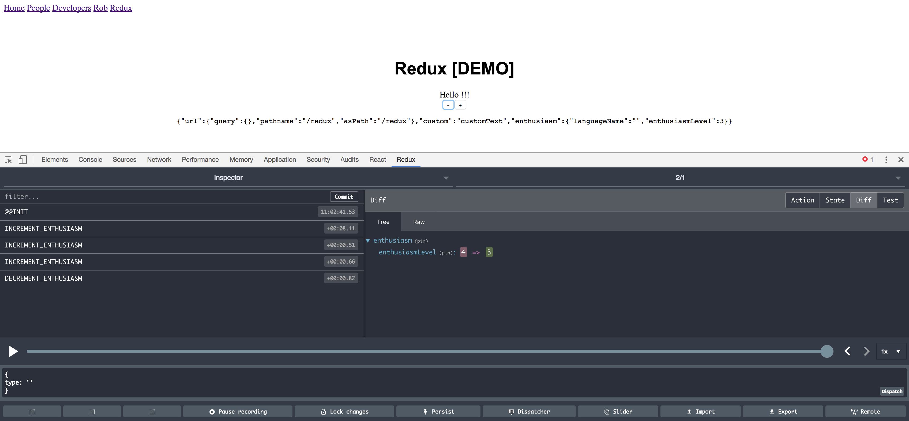
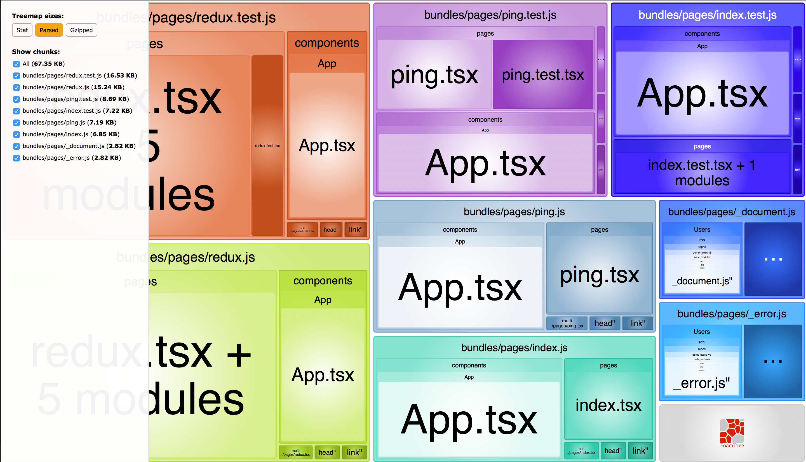
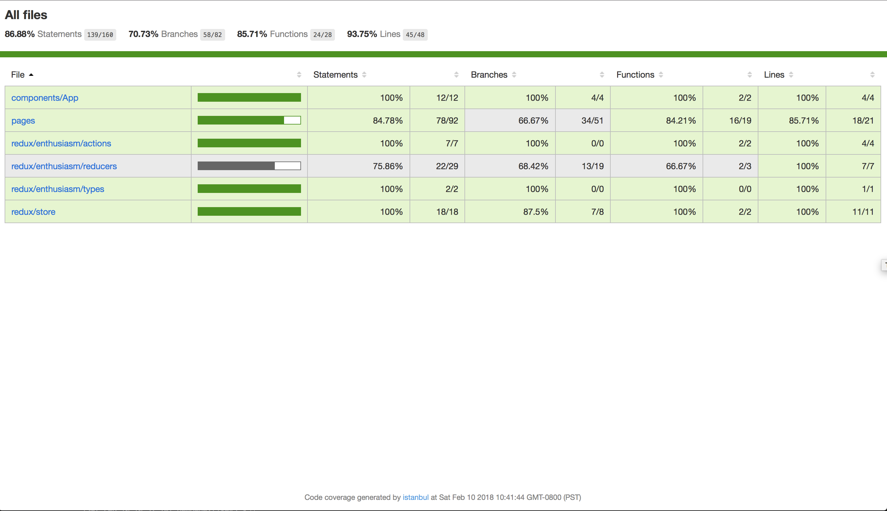

# Welcome
This is a simple demo to explore NextJS v5 with support for:
+ [Jest](https://facebook.github.io/jest/) / [Enzyme](http://airbnb.io/enzyme/)
+ [Redux](https://redux.js.org)
    - [Redux DevTools](https://github.com/zalmoxisus/redux-devtools-extension)
        + Currently supports viewing and debugging your Redux store in
            - Chrome
            - Firefox
            - Electron
        + Please see [remote-redux-devtools](https://github.com/zalmoxisus/remote-redux-devtools) for other browsers/environments
+ [TypeScript](https://www.typescriptlang.org)
+ [Webpack](https://webpack.js.org)

This project even uses [tslint](https://palantir.github.io/tslint/) and [pre-commit](https://www.npmjs.com/package/pre-commit) to make sure the code is clean before a commit can even occur.

## Key features
There are a few key things that I wanted to achieve with this demo:

+ Incorporate the new NextJS 5 with TypeScript and Redux
    - Incorporate Redux DevTools for viewing and debugging the Redux store
+ Incorporate Jest and Enzyme for testing the application
    - My original goal was to have as close to 100% test coverage as REASONABLY POSSIBLE
+ Incorporate a back-end [ExpressJS](http://expressjs.com) server for handling custom server routes

Let's dive into these a bit more...or feel free to skip ahead to "Development".

### TypeScript
This project allows you to have both standard JavaScript and TypeScript code in your project.

If you need to make any modifications to the TypeScript configuration, please see `tsconfig.json`

### Redux
To demonstrate incorporating Redux with TypeScript and NextJS, I used the [original example](https://github.com/Microsoft/TypeScript-React-Starter#typescript-react-starter) from Microsoft at [https://github.com/Microsoft/TypeScript-React-Starter#typescript-react-starter](https://github.com/Microsoft/TypeScript-React-Starter#typescript-react-starter) as a base

If you have Redux DevTools installed, you will see something similar to:


**BONUS: You can have the back-end server preload state. Keep reading.**

### ExpressJS server
This demo uses a lightweight ExpressJS server - `server.js` - to demonstrate how to:

+ Demonstrate how to create an endpoint (for an API, as an example) that does not use NextJS
+ Demonstrate how to server-side render (SSR) NextJS pages
+ Demonstrate server side rendering (SSR) for custom route/paths

#### Endpoint that does not use NextJS
##### /test
This example path is a route that our NextJS app knows absolutely nothing about. It is purely handled by our Express server. You can ping this route to verify that the server is available.

#### Server side rendering (SSR) for NextJS pages
##### /ping
This is simple server side rendering (SSR) for the `ping.tsx` page

##### /redux
This is simple server side rendering (SSR) for the `redux.tsx` page.

NOTE: If the user is having the Redux store populate from the server (such as going to /redux initially or hard refreshing the page), we have special functionality that actually dispatches a few redux actions to pre-populate our store.

**IMPORTANT CONCEPT: The server will render a completely fresh Redux store. If you need to fire off events to pre-populate the store for a particular page, be sure to dispatch actions similar to the example below.**

```sh
  static getInitialProps({ store, isServer }: ReduxWrapper) {
    if (isServer) {
      // For examples of async actions, check out 
      //  https://github.com/kirill-konshin/next-redux-wrapper#async-actions-in-getinitialprops
      store.dispatch(actions.incrementEnthusiasm());
      store.dispatch(actions.incrementEnthusiasm());
      store.dispatch(actions.incrementEnthusiasm());
      store.dispatch(actions.incrementEnthusiasm());
    }
    return { custom: 'customText' };
  }
```

#### Server side rendering (SSR) for custom routes
This example uses the `ping.tsx` as the page we want to render when handling custom routes.

##### Client configuration
In `components/App/App.tsx` notice that we have the following code block:

```sh
      <Link as={`/people`} href={`/ping`}><a>People</a></Link>&nbsp;
      <Link as={`/people/developers`} href={`/ping?slug=developers`}><a>Developers</a></Link>&nbsp;
      <Link as={`/people/developers/rob`} href={`/ping?slug=developers&name=rob`}><a>Rob</a></Link>&nbsp;
```

This tells NextJS that these links will render the `ping.tsx` page, but that we want the URLs to appear as `/people/...` and not just a link to `/ping?slug=developers&name=rob`.

This setup will work fine on the client side...until they try to access the `/people/...` route directly or refresh the web page. To get that to work, we need to modify our lightweight server to explicitly handle those routes.

##### Server configuration
Notice that in our `server.js` file we have the following block of code:

```sh
    server.get('/people', (req, res) => {
      const actualPage = '/ping'
      const queryParams = { }
      app.render(req, res, actualPage, queryParams)
    })

    server.get('/people/:slug', (req, res) => {
      const actualPage = '/ping'
      const queryParams = { slug: req.params.slug, name: req.params.name }
      app.render(req, res, actualPage, queryParams)
    })

    server.get('/people/:slug/:name', (req, res) => {
      const actualPage = '/ping'
      const queryParams = { slug: req.params.slug, name: req.params.name }
      app.render(req, res, actualPage, queryParams)
    })
```

All three of these custom routes render the `ping.tsx` page with the appropriate parameters passed in. This means the user will be able to navigate to the following example URLs in their browser OR by forcing a hard refresh on the server:

+ /people
+ /people/developers
+ /people/developers/Rob


## Development
To verify NextJS is running in development mode, you can simply run:

    $ npm run dev

To verify the ExpressJS server is running in development mode, you should be able to see a response from [http://localhost:3000/test](http://localhost:3000/test) to verify the back-end Express server is running.

### What's in the bundle?
This project includes a helper script that will enable you to interactively explore what is contained within your production app. Simply run:

```sh
$ npm run analyze
```

This will generate an interactive tool to see what the generated bundles for your app contain:


### Testing
This project uses [jest](https://facebook.github.io/jest/) and [enzyme](http://airbnb.io/enzyme/) for testing your React application - and should have high levels of code coverage.

For testing, we have the following scripts I have lovingly crafted in our main `package.json` file:

```sh
    "test": "./node_modules/.bin/jest --no-cache",
    "test:debug": "./node_modules/.bin/jest --debug",
    "test:verbose": "./node_modules/.bin/jest --verbose",
    "test:watch": "./node_modules/.bin/jest --watch"
    "test:coverage": "npm test -- --coverage --no-cache",
    "test:coverage:view": "npm test -- --coverage --no-cache && open coverage/lcov-report/index.html",
```

To run the tests:
```sh
$ npm run <script>
```

Let's take a peek at what each one of the test scripts has to offer.

#### npm run test
This script will run any file(s) that matches the pattern specified in our `jest.config.js` - which is usually any file that contains `.test.` in the name.

#### npm run test:debug
Similar to the above command, this will output debug information for your jest setup and then run through any file(s) that matches the pattern specified in our `jest.config.js` - which is usually any file that contains `.test.` in the name.

#### npm run test:verbose
Similar to `npm run test`, this script will run any file(s) that matches the pattern specified in our `jest.config.js` - which is usually any file that contains `.test.` in the name - and display a verbose output of the tests that were executed.

#### npm run test:watch
This script should be your best friend. It will quietly sit in the background as you make changes and run tests that are affiliated with any and all files you modify.

#### npm run test:coverage
This script will allow you to see how much test coverage you have for your project. Certain files may be excluded from this report (see `collectCoverageFrom` in `jest-config.js`) for more details.


#### npm run test:coverage:view
Similar to the above command, this script will run the code coverage test and open up your browser (on the Mac only) to view an interactive report to see what code is and is not covered adequately:



Don't have a Mac? No problem. Fire up your favorite web browser and open [coverage/lcov-report/index.html](coverage/lcov-report/index.html)

## Production
To verify NextJS is running in production mode, you can simply run:

    $ npm run start

To verify the ExpressJS server is running in development mode, you should be able to see a response from [http://localhost:3000/test](http://localhost:3000/test) to verify the back-end Express server is running.

# Feedback
Please feel free to [create an issue](https://github.com/TheRobBrennan/demo-nextjs-v5/issues) if you have a question or idea for this project.